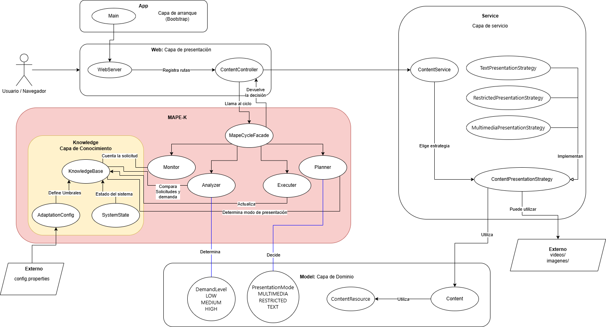
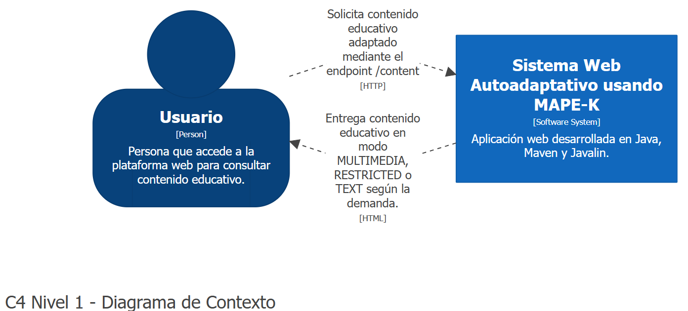
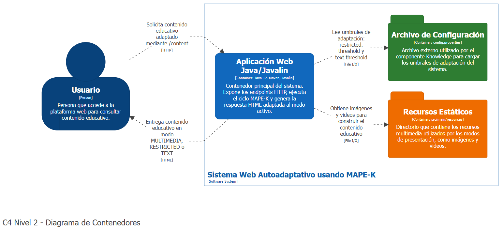
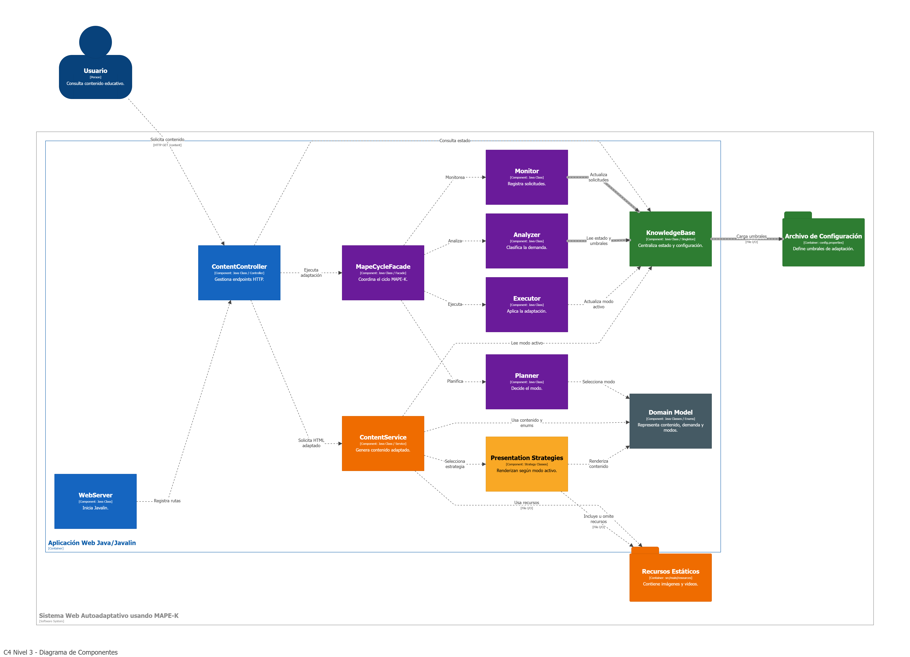
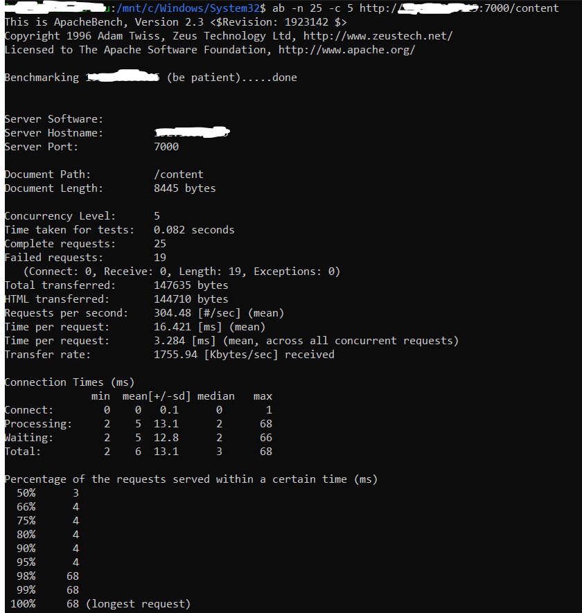
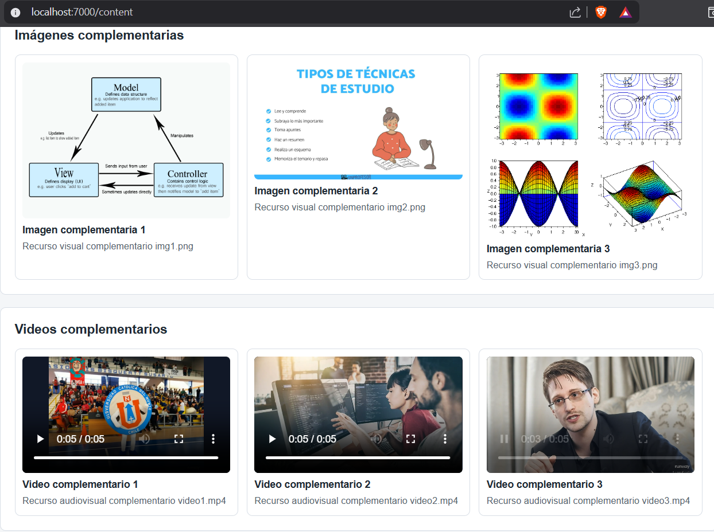
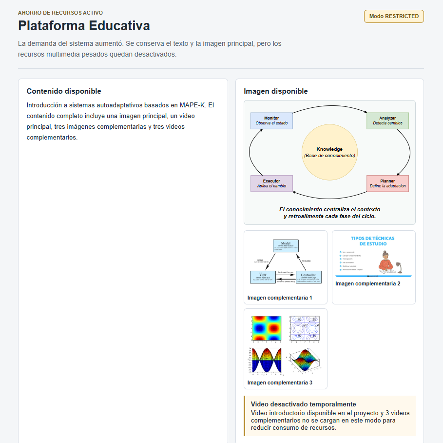
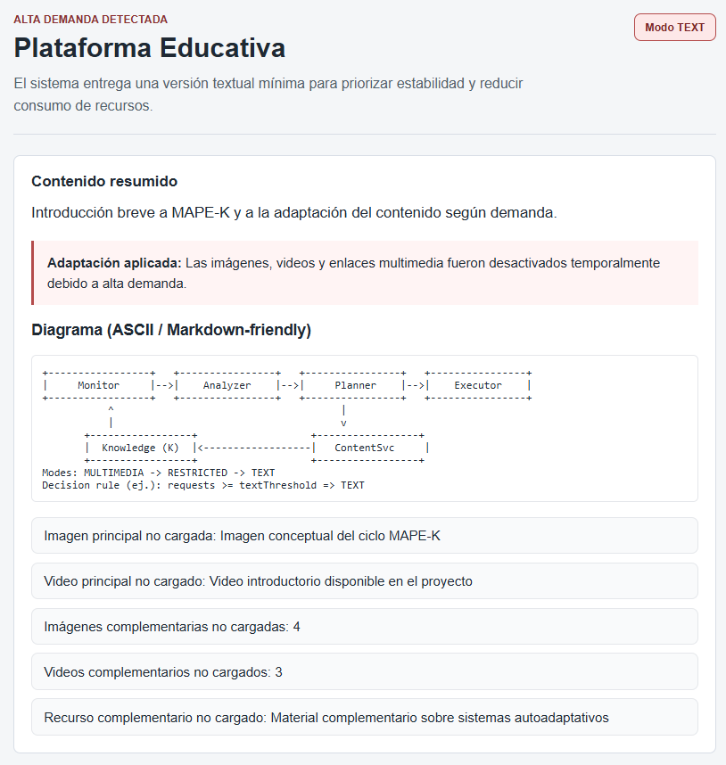

# Taller PSP — Sistema MAPE‑K para gestión de contenidos

**Docente:**
Daniel San Martín

**Curso:**
Patrones de Software y Programación - Universidad Católica del Norte

**Integrantes:**
- Pablo Guzmán (Ingeniería Civil en Computación e Informática)
- Rodrigo Cortés (Ingeniería Civil en Computación e Informática)

**Link del repositorio:**
https://github.com/NicoCG32/Taller2PSP

## Descripción del proyecto

Implementación de un sistema MAPE‑K (Monitor, Analyzer, Planner, Executor y Knowledge) para la adaptación dinámica de contenidos en una aplicación web.

Este proyecto organiza los componentes en capas: módulos de monitorización, análisis, planificación y ejecución, junto con una base de conocimiento y un servicio web para exponer y gestionar contenidos de forma adaptable.

La adaptación se realiza sobre tres modos de presentación:

- **MULTIMEDIA**: entrega completa del contenido, incluyendo texto, imágenes y videos.
- **RESTRICTED**: entrega parcial del contenido, reduciendo recursos pesados.
- **TEXT**: entrega mínima orientada principalmente a texto.

---

## Arquitectura del sistema

Durante el desarrollo del taller se aprovechó la instancia académica para probar esbozos de distintas arquitecturas dentro de un mismo sistema. Sin embargo, es importante precisar que el eje principal del proyecto es **MAPE-K**, ya que el objetivo central del taller es demostrar autoadaptación mediante un ciclo de monitoreo, análisis, planificación y ejecución sobre una base de conocimiento compartida.

Además del eje MAPE-K, el proyecto incorpora elementos de otras arquitecturas con fines de organización y separación de responsabilidades.



### MAPE-K como arquitectura principal

MAPE-K organiza el comportamiento autoadaptativo del sistema. Cada solicitud al endpoint `/content` activa un ciclo donde se monitorea la demanda, se analiza el estado actual, se planifica una adaptación y se ejecuta un cambio en el modo de presentación del contenido.

### Arquitectura en capas como organización estructural

El sistema también puede interpretarse como una arquitectura en capas, ya que separa responsabilidades en distintos niveles:

```text
Capa Web
  ├─ ContentController
  └─ WebServer

Capa de Servicios
  ├─ ContentService
  └─  Estrategias de presentación

Capa Adaptativa
  ├─ Monitor
  ├─ Analyzer
  ├─ Planner
  ├─ Executor
  └─ MapeCycleFacade

Capa de Conocimiento
  ├─ KnowledgeBase
  ├─ SystemState
  └─ AdaptationConfig

Capa de Dominio
  ├─ Content
  ├─ ContentResource
  ├─ DemandLevel
  └─ PresentationMode
```

Esta separación reduce el acoplamiento y permite asignar responsabilidades claras a cada paquete.

### MVC como esbozo complementario

El proyecto también contiene un esbozo de MVC. No se implementa un framework MVC completo, pero sí se observa una separación conceptual entre modelo, vista y controlador.

| Rol MVC | Elementos del proyecto |
|---|---|
| Modelo | `Content`, `ContentResource`, `DemandLevel`, `PresentationMode`, `SystemState` |
| Vista | HTML generado por las estrategias de presentación |
| Controlador | `ContentController` |

Por lo tanto, el proyecto no busca implementar de forma completa y estricta múltiples arquitecturas independientes. MAPE-K define el propósito adaptativo del sistema, mientras que capas y MVC apoyan la organización interna del código.

---

## Diagrama de Arquitectura

La arquitectura del sistema se documenta utilizando el modelo **C4**, el cual permite representar un sistema de software en distintos niveles de abstracción. En este proyecto se utilizan tres niveles: contexto, contenedores y componentes.

El objetivo de estos diagramas es mostrar progresivamente cómo está estructurado el **Sistema Web Autoadaptativo usando MAPE-K**, partiendo desde una visión general del sistema hasta llegar a la organización interna de sus componentes principales.

Los diagramas se encuentran en la siguiente ruta del repositorio:

```text
docs/diagrams/architecture/c4/
```

---

### C4 Nivel 1: Contexto del sistema

El **Nivel 1** corresponde al diagrama de contexto. En este nivel, el sistema se representa como una caja negra, sin mostrar detalles internos de implementación.

Este diagrama permite identificar:

- el actor principal del sistema;
- el sistema de software desarrollado;
- la relación general entre el usuario y la plataforma.

En este proyecto, el actor principal es el **Usuario**, quien accede a la plataforma para consultar contenido educativo. El sistema responde entregando contenido adaptado según el nivel de demanda detectado.



---

### C4 Nivel 2: Contenedores

El **Nivel 2** corresponde al diagrama de contenedores. En este nivel se descompone el sistema en sus principales unidades ejecutables o estructurales.

Para este proyecto, el contenedor principal es la **Aplicación Web Java/Javalin**, encargada de recibir solicitudes HTTP, ejecutar el ciclo MAPE-K y entregar contenido adaptado al usuario.

Además, se representan elementos de apoyo como:

- el archivo `config.properties`, utilizado para definir los umbrales de adaptación;
- los recursos estáticos del sistema, como imágenes y videos utilizados por los distintos modos de presentación.

Este nivel permite observar que el sistema no depende de una base de datos externa, sino que mantiene su configuración mediante un archivo de propiedades y sus recursos mediante archivos estáticos.



---

### C4 Nivel 3: Componentes

El **Nivel 3** corresponde al diagrama de componentes. Este nivel abre el contenedor principal, es decir, la **Aplicación Web Java/Javalin**, para mostrar cómo se organiza internamente.

En este diagrama se evidencia con mayor claridad que la arquitectura principal del proyecto es **MAPE-K**, ya que el sistema se estructura alrededor de los siguientes componentes:

- `Monitor`: registra las solicitudes recibidas.
- `Analyzer`: analiza la cantidad de solicitudes y clasifica el nivel de demanda.
- `Planner`: decide qué modo de presentación debe activarse.
- `Executor`: aplica la adaptación correspondiente.
- `KnowledgeBase`: centraliza el estado actual del sistema y los parámetros de configuración.

Además del ciclo MAPE-K, el Nivel 3 también muestra componentes de apoyo:

- `ContentController`, encargado de recibir las solicitudes HTTP.
- `ContentService`, encargado de generar el contenido adaptado.
- `Presentation Strategies`, encargadas de renderizar el contenido según el modo activo.
- `Domain Model`, que representa el contenido educativo, los modos de presentación y los niveles de demanda.

Este diagrama es el más relevante para justificar la arquitectura interna del sistema, ya que muestra cómo una solicitud al endpoint `/content` activa el ciclo MAPE-K antes de entregar la respuesta al usuario.



## Compilación y ejecución

Para compilar el proyecto:

```bash
mvn clean compile
```

Para ejecutar la aplicación:

```bash
mvn exec:java
```

Una vez iniciado el servidor, acceder a:

```text
http://localhost:7000/content
```

## Endpoints disponibles

El servidor web se ejecuta localmente en el puerto `7000`.

| Método | Endpoint | Descripción |
|---|---|---|
| `GET` | `/content` | Endpoint principal. Ejecuta el ciclo MAPE-K y muestra contenido adaptado. |
| `GET` | `/status` | Retorna el estado actual del sistema en formato JSON. |
| `GET` | `/reset` | Reinicia la simulación, dejando el contador en cero y el modo en `MULTIMEDIA`. |
| `GET` | `/` | Página de inicio o redirección informativa del sistema. |

### `/content`

URL:

```text
http://localhost:7000/content
```

Este endpoint ejecuta el ciclo MAPE-K. Cada llamada incrementa el contador de solicitudes y puede provocar un cambio de modo.

### `/status`

URL:

```text
http://localhost:7000/status
```

Respuesta esperada:

```json
{
  "mode": "TEXT",
  "requests": 25,
  "restrictedThreshold": 10,
  "textThreshold": 20
}
```

### `/reset`

URL:

```text
http://localhost:7000/reset
```

Este endpoint reinicia la simulación:

- contador de solicitudes en `0`;
- modo activo en `MULTIMEDIA`.

## Prueba de carga

Para comprobar la autoadaptación del sistema se realizó una prueba de carga utilizando **Apache Bench** (`ab`) sobre el endpoint principal del sistema:

```text
http://localhost:7000/content
```

La prueba consistió en enviar múltiples solicitudes HTTP al servidor para verificar que el sistema cambiara automáticamente entre los modos de presentación definidos: `MULTIMEDIA`, `RESTRICTED` y `TEXT`.

### Instalación de herramientas

#### En Windows

Si se utiliza Windows, primero se debe instalar **WSL** (*Windows Subsystem for Linux*) ejecutando el siguiente comando en PowerShell:

```powershell
wsl --install
```

Luego se deben seguir las instrucciones de instalación, crear un usuario y una contraseña para la distribución Linux instalada.

#### En Linux

Si se utiliza Linux directamente, no es necesario instalar WSL.

---

### Instalación de Homebrew

Luego se instaló Homebrew con el siguiente comando:

```bash
/bin/bash -c "$(curl -fsSL https://raw.githubusercontent.com/Homebrew/install/HEAD/install.sh)"
```

En Windows, este comando debe ejecutarse dentro de la consola de WSL.  
En Linux, debe ejecutarse directamente en la terminal del sistema.

---

### Instalación de Apache Bench

Para instalar Apache Bench se utilizaron los siguientes comandos:

```bash
sudo apt update
sudo apt install apache2-utils
```

El paquete `apache2-utils` instala la herramienta `ab`, utilizada para realizar la prueba de carga.

---

### Ejecución de la prueba

Antes de ejecutar la prueba, se debe asegurar que el servidor del proyecto esté encendido.

Luego se ejecutó el siguiente comando:

```bash
ab -n 25 -c 5 http://192.168.x.x:7000/content
```

Donde:

- `-n 25` indica que se enviaron 25 solicitudes en total.
- `-c 5` indica que se realizaron 5 solicitudes concurrentes.
- `192.168.x.x` debe reemplazarse por la dirección IPv4 del equipo donde se está ejecutando el servidor.
- `/content` corresponde al endpoint principal que activa el ciclo MAPE-K.

Ejemplo:

```bash
ab -n 25 -c 5 http://192.168.1.35:7000/content
```

---

### Resultado esperado

Con la configuración de umbrales:

```properties
restricted.threshold=10
text.threshold=20
```

el comportamiento esperado del sistema es el siguiente:

| Cantidad de solicitudes | Modo esperado |
|---:|---|
| 0 a 9 | `MULTIMEDIA` |
| 10 a 19 | `RESTRICTED` |
| 20 o más | `TEXT` |

Por lo tanto, al ejecutar una prueba con 25 solicitudes, el sistema debe superar ambos umbrales y finalizar en modo `TEXT`.

---

### Evidencia de la prueba

La siguiente imagen muestra el resultado obtenido al ejecutar la prueba de carga con Apache Bench sobre el endpoint `/content`:



La salida generada por Apache Bench permite evidenciar que las solicitudes fueron enviadas correctamente al servidor web. Además, el sistema genera registros en consola donde se observa la ejecución del ciclo MAPE-K durante la prueba.

El registro de consola utilizado como evidencia se encuentra disponible en el siguiente archivo:

[Ver logs del ciclo MAPE-K](ref/logs/stack%20trace.txt)

En dicho registro debe evidenciarse el avance del ciclo adaptativo, por ejemplo:

```text
[MONITOR] Solicitud registrada. Total actual: 10
[ANALYZE] Demanda media detectada.
[PLAN] Activar modo restringido.
[EXECUTE] El sistema cambio a modo RESTRICTED.

[MONITOR] Solicitud registrada. Total actual: 20
[ANALYZE] Alta demanda detectada.
[PLAN] Activar modo texto.
[EXECUTE] El sistema cambio a modo TEXT.
```

---

### Verificación del estado final

Finalmente, se debe consultar el endpoint `/status` para verificar el estado final del sistema:

```bash
curl http://192.168.x.x:7000/status
```

La respuesta esperada es similar a:

```json
{
  "mode": "TEXT",
  "requests": 25,
  "restrictedThreshold": 10,
  "textThreshold": 20
}
```

Esto confirma que, luego de la prueba de carga, el sistema superó el umbral de alta demanda y cambió automáticamente al modo `TEXT`.

---

## Documentación técnica con Doxygen

El proyecto incluye una configuración de Doxygen en:

```text
docs/doxygen/Doxyfile
```

Para generar la documentación técnica del código:

```bash
doxygen docs/doxygen/Doxyfile
```

La documentación HTML se genera en:

```text
docs/doxygen/generated/html/index.html
```

En PowerShell, puede abrirse con:

```powershell
Start-Process .\docs\doxygen\generated\html\index.html
```

Es necesario tener Doxygen instalado y disponible en el `PATH` del sistema.

---

## Estructura de carpetas

```
Taller2PSP/
├─ config.properties
├─ docs/
│  ├─ diagrams/
│  └─ doxygen/
│     └─ Doxyfile
├─ pom.xml
├─ README.md
├─ ref/
│  └─ Taller.pdf
└─ src/
	└─ main/
		├─ java/
		│  ├─ app/
		│  │  └─ Main.java
		│  ├─ knowledge/
		│  │  ├─ AdaptationConfig.java
		│  │  ├─ KnowledgeBase.java
		│  │  └─ SystemState.java
		│  ├─ mape/
		│  │  ├─ Analyzer.java
		│  │  ├─ Executor.java
		│  │  ├─ MapeCycleFacade.java
		│  │  ├─ Monitor.java
		│  │  └─ Planner.java
		│  ├─ model/
		│  │  ├─ Content.java
		│  │  ├─ ContentResource.java
		│  │  ├─ DemandLevel.java
		│  │  └─ PresentationMode.java
		│  ├─ service/
		│  │  ├─ ContentService.java
		│  │  └─ strategy/
		│  │     ├─ ContentPresentationStrategy.java
		│  │     ├─ MultimediaPresentationStrategy.java
		│  │     ├─ RestrictedPresentationStrategy.java
		│  │     └─ TextPresentationStrategy.java
		│  └─ web/
		│     ├─ ContentController.java
		│     └─ WebServer.java
		└─ resources/
			├─ images/
			└─ videos/
				
```

## Evidencia de modos de presentación

Para comprobar visualmente la autoadaptación del sistema, se registraron capturas de pantalla correspondientes a los tres modos de presentación implementados: `MULTIMEDIA`, `RESTRICTED` y `TEXT`.

Estas capturas permiten evidenciar que el sistema modifica el tipo de contenido mostrado al usuario según el nivel de demanda detectado por el ciclo MAPE-K.

---

### Modo MULTIMEDIA

El modo `MULTIMEDIA` corresponde al estado normal del sistema, asociado a una demanda baja.

En este modo, el sistema muestra el contenido educativo completo, incluyendo:

- título;
- descripción;
- imágenes;
- video o enlace multimedia.

Captura del sistema en modo `MULTIMEDIA`:



---

### Modo RESTRICTED

El modo `RESTRICTED` corresponde al estado de demanda media.

En este modo, el sistema reduce parcialmente el contenido mostrado, manteniendo información principal e imágenes, pero desactivando recursos multimedia más pesados, como videos o enlaces enriquecidos.

El sistema debe llegar a este modo cuando la cantidad de solicitudes alcanza el primer umbral definido en `config.properties`.

Con la configuración utilizada:

```properties
restricted.threshold=10
text.threshold=20
```

el modo `RESTRICTED` se activa desde las 10 solicitudes hasta antes de alcanzar las 20 solicitudes.

Captura del sistema en modo `RESTRICTED`:



---

### Modo TEXT

El modo `TEXT` corresponde al estado de alta demanda.

En este modo, el sistema muestra una versión mínima del contenido, basada principalmente en texto. Además, informa que los recursos multimedia fueron desactivados temporalmente debido a la alta demanda.

El sistema debe llegar a este modo cuando la cantidad de solicitudes alcanza el segundo umbral definido en `config.properties`.

Con la configuración utilizada:

```properties
restricted.threshold=10
text.threshold=20
```

el modo `TEXT` se activa desde las 20 solicitudes en adelante.

Captura del sistema en modo `TEXT`:



---

### Resumen de evidencia visual

| Modo | Nivel de demanda | Contenido mostrado | Captura |
|---|---|---|---|
| `MULTIMEDIA` | Baja | Texto, imágenes y recursos multimedia completos | `ref/screenshots/MULTIMEDIA.png` |
| `RESTRICTED` | Media | Texto e imágenes; recursos pesados desactivados | `ref/screenshots/RESTRINGIDO.png` |
| `TEXT` | Alta | Texto resumido y mensaje de desactivación multimedia | `ref/screenshots/TEXT.png` |

Estas capturas evidencian que el sistema cambia correctamente entre los tres modos de presentación solicitados en el taller.

## Patrones de diseño utilizados

Como parte del proceso de aprendizaje también se decidió experimentar con contenidos previos del curso.
El sistema incorpora patrones de diseño que apoyan la organización interna del código.

### Singleton

El patrón **Singleton** se utiliza en `KnowledgeBase`.

Su propósito es asegurar que los componentes del ciclo MAPE-K compartan la misma base de conocimiento y no existan múltiples instancias inconsistentes del estado del sistema.

Uso conceptual:

```text
KnowledgeBase.getInstance()
```

Responsabilidades asociadas:

- Centralizar el estado del sistema.
- Compartir configuración entre componentes.
- Mantener coherencia en el modo activo.
- Evitar duplicación de información crítica.

### Facade

El patrón **Facade** se utiliza en `MapeCycleFacade`.

Este patrón encapsula la ejecución completa del ciclo MAPE-K mediante una interfaz simple. Así, la capa web no necesita conocer el detalle interno de `Monitor`, `Analyzer`, `Planner` y `Executor`.

Flujo encapsulado:

```text
runCycle()
  -> monitor.registerRequest()
  -> analyzer.analyzeDemand()
  -> planner.planAdaptation()
  -> executor.executeAdaptation()
```

Responsabilidades asociadas:

- Simplificar la ejecución del ciclo adaptativo.
- Reducir el acoplamiento entre la capa web y la lógica MAPE-K.
- Concentrar el flujo principal de adaptación en una clase coordinadora.

### Strategy

El patrón **Strategy** se utiliza para variar la forma de presentar el contenido según el modo activo.

Interfaz principal:

```text
ContentPresentationStrategy
```

Estrategias implementadas:

| Estrategia | Modo asociado | Responsabilidad |
|---|---|---|
| `MultimediaPresentationStrategy` | `MULTIMEDIA` | Renderiza contenido completo. |
| `RestrictedPresentationStrategy` | `RESTRICTED` | Renderiza contenido con recursos multimedia reducidos. |
| `TextPresentationStrategy` | `TEXT` | Renderiza contenido mínimo basado en texto. |

Este patrón evita concentrar toda la lógica de presentación en una única clase con múltiples condicionales.

---

_Proyecto académico — enfoque en patrones de software y arquitectura de sistemas._