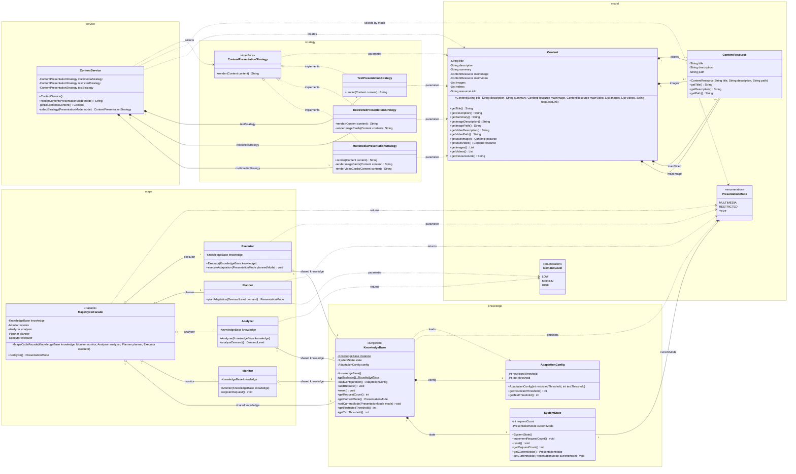

# Diagrama de clases UML

Sólo por completitud elaborado con mermaid.

```mermaid
classDiagram
    direction LR

    namespace mape {
        class MapeCycleFacade {
            <<Facade>>
            -KnowledgeBase knowledge
            -Monitor monitor
            -Analyzer analyzer
            -Planner planner
            -Executor executor
            +MapeCycleFacade(KnowledgeBase knowledge, Monitor monitor, Analyzer analyzer, Planner planner, Executor executor)
            +runCycle() PresentationMode
        }

        class Monitor {
            -KnowledgeBase knowledge
            +Monitor(KnowledgeBase knowledge)
            +registerRequest() void
        }

        class Analyzer {
            -KnowledgeBase knowledge
            +Analyzer(KnowledgeBase knowledge)
            +analyzeDemand() DemandLevel
        }

        class Planner {
            +planAdaptation(DemandLevel demand) PresentationMode
        }

        class Executor {
            -KnowledgeBase knowledge
            +Executor(KnowledgeBase knowledge)
            +executeAdaptation(PresentationMode plannedMode) void
        }
    }

    namespace knowledge {
        class KnowledgeBase {
            <<Singleton>>
            -KnowledgeBase instance$
            -SystemState state
            -AdaptationConfig config
            -KnowledgeBase()
            +getInstance()$ KnowledgeBase
            -loadConfiguration() AdaptationConfig
            +addRequest() void
            +reset() void
            +getRequestCount() int
            +getCurrentMode() PresentationMode
            +setCurrentMode(PresentationMode mode) void
            +getRestrictedThreshold() int
            +getTextThreshold() int
        }

        class SystemState {
            -int requestCount
            -PresentationMode currentMode
            +SystemState()
            +incrementRequestCount() void
            +reset() void
            +getRequestCount() int
            +getCurrentMode() PresentationMode
            +setCurrentMode(PresentationMode currentMode) void
        }

        class AdaptationConfig {
            -int restrictedThreshold
            -int textThreshold
            +AdaptationConfig(int restrictedThreshold, int textThreshold)
            +getRestrictedThreshold() int
            +getTextThreshold() int
        }
    }

    namespace service {
        class ContentService {
            -ContentPresentationStrategy multimediaStrategy
            -ContentPresentationStrategy restrictedStrategy
            -ContentPresentationStrategy textStrategy
            +ContentService()
            +renderContent(PresentationMode mode) String
            -getEducationalContent() Content
            -selectStrategy(PresentationMode mode) ContentPresentationStrategy
        }
    }

    namespace strategy {
        class ContentPresentationStrategy {
            <<interface>>
            +render(Content content) String
        }

        class MultimediaPresentationStrategy {
            +render(Content content) String
            -renderImageCards(Content content) String
            -renderVideoCards(Content content) String
        }

        class RestrictedPresentationStrategy {
            +render(Content content) String
            -renderImageCards(Content content) String
        }

        class TextPresentationStrategy {
            +render(Content content) String
        }
    }

    namespace model {
        class Content {
            -String title
            -String description
            -String summary
            -ContentResource mainImage
            -ContentResource mainVideo
            -List images
            -List videos
            -String resourceLink
            +Content(String title, String description, String summary, ContentResource mainImage, ContentResource mainVideo, List images, List videos, String resourceLink)
            +getTitle() String
            +getDescription() String
            +getSummary() String
            +getImageDescription() String
            +getImagePath() String
            +getVideoDescription() String
            +getVideoPath() String
            +getMainImage() ContentResource
            +getMainVideo() ContentResource
            +getImages() List
            +getVideos() List
            +getResourceLink() String
        }

        class ContentResource {
            -String title
            -String description
            -String path
            +ContentResource(String title, String description, String path)
            +getTitle() String
            +getDescription() String
            +getPath() String
        }

        class DemandLevel {
            <<enumeration>>
            LOW
            MEDIUM
            HIGH
        }

        class PresentationMode {
            <<enumeration>>
            MULTIMEDIA
            RESTRICTED
            TEXT
        }
    }

    ContentPresentationStrategy <|.. MultimediaPresentationStrategy : implements
    ContentPresentationStrategy <|.. RestrictedPresentationStrategy : implements
    ContentPresentationStrategy <|.. TextPresentationStrategy : implements

    KnowledgeBase "1" *-- "1" SystemState : state
    KnowledgeBase "1" *-- "1" AdaptationConfig : config

    Content "1" *-- "0..1" ContentResource : mainImage
    Content "1" *-- "0..1" ContentResource : mainVideo
    Content "1" *-- "0..*" ContentResource : images
    Content "1" *-- "0..*" ContentResource : videos

    ContentService "1" *-- "1" MultimediaPresentationStrategy : multimediaStrategy
    ContentService "1" *-- "1" RestrictedPresentationStrategy : restrictedStrategy
    ContentService "1" *-- "1" TextPresentationStrategy : textStrategy

    MapeCycleFacade "1" o-- "1" KnowledgeBase : shared knowledge
    MapeCycleFacade "1" o-- "1" Monitor : monitor
    MapeCycleFacade "1" o-- "1" Analyzer : analyzer
    MapeCycleFacade "1" o-- "1" Planner : planner
    MapeCycleFacade "1" o-- "1" Executor : executor

    Monitor "1" o-- "1" KnowledgeBase : shared knowledge
    Analyzer "1" o-- "1" KnowledgeBase : shared knowledge
    Executor "1" o-- "1" KnowledgeBase : shared knowledge

    SystemState "1" --> "1" PresentationMode : currentMode

    Analyzer ..> DemandLevel : returns
    Planner ..> DemandLevel : parameter
    Planner ..> PresentationMode : returns
    Executor ..> PresentationMode : parameter
    MapeCycleFacade ..> PresentationMode : returns

    KnowledgeBase ..> PresentationMode : gets/sets
    KnowledgeBase ..> AdaptationConfig : loads

    ContentService ..> Content : creates
    ContentService ..> PresentationMode : selects by mode
    ContentService ..> ContentPresentationStrategy : selects

    ContentPresentationStrategy ..> Content : parameter
    MultimediaPresentationStrategy ..> Content : parameter
    RestrictedPresentationStrategy ..> Content : parameter
    TextPresentationStrategy ..> Content : parameter

```